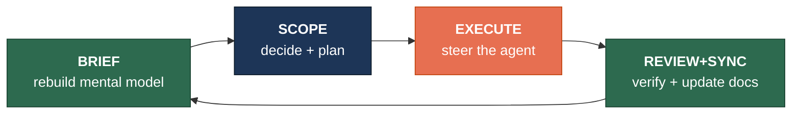

# BSER Framework

**Brief → Scope → Execute → Review+Sync**

A structured methodology for human-in-the-loop agentic development with CLI coding agents. Built for [Kilo Code CLI](https://kilo.ai/cli), but the principles apply to any agent-assisted workflow.



## The Problem

Autonomous coding agents can run for hours unsupervised. But when *you're* in the loop — steering the agent, making decisions, reviewing output — the bottleneck shifts to you. You end up simultaneously playing architect, PM, developer, and reviewer, with no structure telling you which hat to wear when.

BSER fixes this by splitting agentic work into four phases with clear boundaries. The agent handles the heavy lifting in phases 1 and 4 (briefing and review/sync), while you focus your energy on phases 2 and 3 (deciding what to build and steering the implementation).

## What's in the Box

| Component | What It Does |
|-----------|-------------|
| **Slash commands** | `/brief`, `/scope`, `/epic`, `/implement`, `/review`, `/sync`, `/recap`, `/impact`, `/estimate`, `/hotfix` — each one is a markdown file with a prompt template |
| **Subagents** | `@reviewer` (read-only code review with live browser verification), `@syncer` (post-merge doc updates), `@reporter` (HTML report generator — the human interface layer) |
| **Living docs** | `AGENTS.md`, `ARCHITECTURE.md`, `CONVENTIONS.md` — updated automatically by the sync phase, not manually maintained |
| **Plan documents** | `.plans/` directory with per-task plans, epic decomposition docs, test baselines, and a backlog |
| **Visual reports** | Every human-facing output (briefs, reviews, recaps, impact analyses) is rendered as a polished HTML report with mermaid diagrams and auto-opens in your browser |

## Key Ideas

**Your mental model is the bottleneck.** Every session starts with `/brief`, which generates a visual report of what changed, what's in progress, and what to do next. You never start cold.

**Plans are the contract.** Every task gets a plan document before implementation begins. The agent implements against the plan, the review checks against the plan, and scope creep gets captured in a "Future" section instead of leaking into the current task.

**Epics decompose large work.** Multi-module refactors and large features use `/epic` to create a dedicated long-lived branch with ordered phases. Each phase follows the normal BSER loop and merges back into the epic branch. Main stays clean until the epic is done.

**The reporter is the human interface.** All context transfer from agents to you flows through the `@reporter` subagent, which renders self-contained HTML reports with stat cards, tables, mermaid diagrams, and embedded screenshots. No more skimming walls of terminal text.

**Docs stay alive automatically.** `ARCHITECTURE.md` and `CONVENTIONS.md` are updated as a side effect of every merge via the sync phase — not as a separate chore you schedule and skip.

## Getting Started

1. Read **[BSER-setup.md](BSER-setup.md)** — one-time setup guide with all the files, commands, subagents, and templates
2. Read **[BSER-workflow.md](BSER-workflow.md)** — daily reference for how to actually work (assumes setup is done)

If you're migrating a project from an earlier version, see the migration section in the setup guide.

## Requirements

- [Kilo Code CLI](https://kilo.ai/cli)
- Git
- [agent-browser](https://github.com/vercel-labs/agent-browser) (for live UI verification and screenshot capture)

## Project Structure

```
your-project/
├── AGENTS.md                    # Project-wide agent behavior rules
├── ARCHITECTURE.md              # Living architecture doc (auto-updated)
├── CONVENTIONS.md               # Coding patterns and decisions (auto-updated)
├── .plans/
│   ├── _TEMPLATE.md             # Plan document template
│   ├── _EPIC_TEMPLATE.md        # Epic decomposition template
│   ├── backlog.md               # Captured future work items
│   ├── add-xer-parser.md        # Example: task plan
│   └── refactor-auth.md         # Example: epic plan
├── .kilocode/commands/
│   ├── brief.md                 # /brief command
│   ├── scope.md                 # /scope command
│   ├── epic.md                  # /epic command
│   ├── implement.md             # /implement command
│   ├── review.md                # /review command
│   ├── sync.md                  # /sync command
│   ├── recap.md                 # /recap command
│   ├── impact.md                # /impact command
│   ├── estimate.md              # /estimate command
│   └── hotfix.md                # /hotfix command
├── .kilo/agents/
│   ├── reviewer.md              # Code review subagent
│   ├── syncer.md                # Doc sync subagent
│   └── reporter.md              # HTML report generator subagent
└── .reports/                    # Generated reports (gitignored)
    └── screenshots/             # Review screenshots (gitignored)
```

## License

MIT