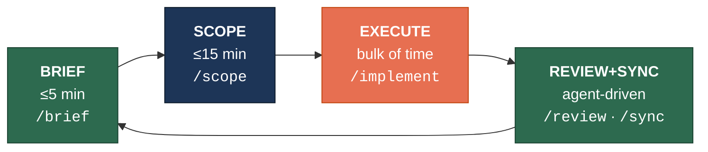
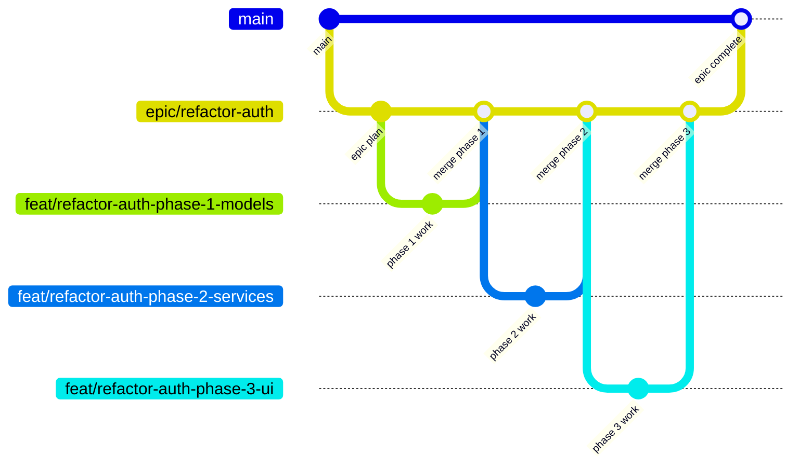

# BSER Framework — Daily Workflow

> Quick reference for the Brief → Scope → Execute → Review+Sync loop.
> Assumes setup from **BSER-setup.md** is complete.

---

## The Loop



**Phases 1 and 4 are agent-driven.** You read and approve.
**Phases 2 and 3 are where you focus.** You decide and steer.

**All human-facing context is rendered as HTML reports** in `.reports/` by the `@reporter` subagent. Briefs, recaps, reviews, impact analyses, and estimates all produce visual reports you can open in a browser — not terminal text you skim and forget.

---

## Examples

Real-world examples demonstrating BSER in action are available in `setup/examples/`:

| Type | Location | Use Case |
|------|----------|----------|
| [Feature Workflow](../setup/examples/workflows/feature-workflow.md) | Full BSER loop walkthrough | Learning BSER or starting a feature |
| [Bugfix Workflow](../setup/examples/workflows/bugfix-workflow.md) | Fast-path bugfix | Quick fixes with minimal overhead |
| [Epic Workflow](../setup/examples/workflows/epic-workflow.md) | Multi-phase epic walkthrough | Large tasks requiring decomposition |
| [Payment Refactor Scenario](../setup/examples/scenarios/payment-refactor.md) | Complex migration pattern | High-risk refactors with parallel run |

See [setup/examples/README.md](../setup/examples/README.md) for the full index.

---

## Phase 1: Brief

**Duration:** ≤5 minutes. **Your role:** Read.

```
/brief
```

This generates a visual briefing report at `.reports/brief-<date>.html` and opens it. Don't start planning in your head yet — just absorb:

- What happened since you last touched this project
- What branch you're on, what's uncommitted
- Which plans are in progress
- What the agent suggests working on next

**Then immediately move to Phase 2.** If you catch yourself re-running `/brief` or stalling here, pick the first suggested action and go.

---

## Phase 2: Scope

**Duration:** ≤15 minutes (set a timer). **Your role:** Decide what, not how.

### Standard Task

```
/scope Add XER file parsing support for the import module
```

You describe the task in plain English. The agent derives a kebab-case slug (e.g., `add-xer-parser`), creates the branch, and writes the plan. It will:
1. Derive a slug and present it for your approval
2. Create a `feat/<slug>` branch from main (or from the epic branch if applicable)
3. Generate an implementation plan
4. Save it to `.plans/<slug>.md`
5. Commit the plan

Review the slug and plan. Adjust if needed. Then move to Execute.

### Rules

- **One sentence or it's too big.** If you can't describe the task in one sentence, split it — or use `/epic`.
- **"Yeah but..." trap.** When you think "yeah but we should also..." — add it to the Future section and move on.
- **15-minute hard cap.** Timer rings → you either have a plan or you pick something smaller.
- **No implementation during scoping.** Not even "let me just quickly..." — that's Phase 3.

---

## Phase 3: Execute

**Duration:** The bulk of your work session. **Your role:** Steer the agent.

### First Session

```
/implement <task-name>
```

The agent will read the plan, check test status, and start building with TDD.

### Subsequent Sessions (Fresh Context)

```
/implement <task-name>
```

Same command, new Kilo session. The agent re-reads the plan and git state to pick up where it left off. Typically 2-3 sessions per feature.

### Rules

- **No new plans during execution.** Discovered something? Add to `.plans/backlog.md` and continue.
- **No architecture changes.** If the plan is wrong, stop and go back to Scope. Don't improvise.
- **No scope expansion.** The plan is the contract. New ideas go to Future/backlog.
- **Verify commits.** The agent should be committing as it goes. Check with `git log --oneline` between sessions.

### When You're Stuck

If the agent is going in circles or the approach isn't working:

1. Stop the current session.
2. Start a fresh session in architect mode: `/mode architect`
3. Discuss the problem, update the plan doc.
4. Return to `/implement <task-name>` in a new session.

Don't debug inside an execution session that's already confused — fresh context is cheap.

---

## Phase 4: Review + Sync

**Duration:** 10-15 minutes. **Your role:** Approve.

### 4a: Review

```
/review <task-name>
```

This generates a visual review report at `.reports/review-<task>-<date>.html` showing the diff summary, findings, test results, and verdict. For a deeper review, you can also invoke the `reviewer` subagent directly:

```
@reviewer Review the diff of this branch against main, referencing the plan in .plans/<task-name>.md
```

The reviewer agent has locked-down permissions — it can run `git diff`, `git log`, and the test suite, but cannot edit files.

- **PASS →** Merge and move to Sync.
- **NEEDS WORK →** The review also writes a `.plans/<task-name>.fixlist.md` with specific issues. Run `/implement <task-name>` — it will automatically pick up the fixlist and address only those issues. Then `/review` again.
- **Max 2 review cycles.** If it's not passing after two rounds, merge what works and file follow-ups.

### Merge

```bash
git checkout main
git merge feat/<task-name>
```

### 4b: Sync

```
/sync <task-name>
```

Or invoke the syncer subagent directly:

```
@syncer Sync docs after merging <task-name>
```

The syncer agent can only edit markdown files — it cannot touch source code. It updates:
- `ARCHITECTURE.md` (if structural changes were made)
- `CONVENTIONS.md` (if new patterns were established)
- `.plans/<task-name>.md` completion log
- Moves out-of-scope items to `.plans/backlog.md`

**Do not skip this step.** This is what keeps `/brief` accurate for your next session.

### Clean Up

```bash
git branch -d feat/<task-name>
```

---

## Large Tasks (Epics)

When a task is too big for a single BSER loop — multi-module refactors, large features, migrations — use an epic to decompose it into phases.

### Branching Strategy

Epics use a dedicated long-lived branch. Phase branches are created from and merged back into the epic branch. The epic branch merges to main only when the full epic is complete.



### Step by Step

1. **Decompose once:**
   ```
   /epic <epic-name>
   ```
   This creates the `epic/<epic-name>` branch from main, the epic plan doc at `.plans/epics/<slug>/README.md`, and a visual planning report. See `setup/commands/epic.md` for the full decomposition process.

2. **Execute phase by phase.** For each phase in order:
   ```
   /brief                              (re-sync your mental model)
   /scope <epic>-phase-N-<description> (branches from epic/<epic-name> automatically)
   /implement <epic>-phase-N-...       (normal BSER execute, 2-3 sessions)
   /review <epic>-phase-N-...          (review against the epic branch, not main)
   → merge to epic/<epic-name>
   /sync <epic>-phase-N-...            (update docs, mark phase complete)
   ```

   After each phase merges to the epic branch, review what you learned and update the epic's `## Context & Learnings` section before scoping the next phase.

   The merge step for phases:
   ```bash
   git checkout epic/<epic-name>
   git merge feat/<epic>-phase-N-...
   git branch -d feat/<epic>-phase-N-...
   ```

3. **Re-evaluate between phases.** After merging each phase, before scoping the next one:
   - Run `/brief` — your mental model needs refreshing because the epic branch just changed.
   - Re-read the epic doc. Does the next phase still make sense?
   - If the decomposition needs adjustment, update the epic doc's phases table.

4. **Merge the epic to main** when all phases are complete and the exit criteria are met:
   ```bash
   git checkout main
   git merge epic/<epic-name>
   git branch -d epic/<epic-name>
   ```
   Run a final `/sync` to update ARCHITECTURE.md and mark the epic doc as COMPLETE.

### Rules for Epics

- **One phase in flight at a time.** Don't start phase 2 while phase 1 is unmerged. Each phase merges to the epic branch before the next begins.
- **Each phase is a normal BSER loop.** Branch-per-phase, review gate, doc sync — all still apply. An epic doesn't bypass the discipline; it sequences it.
- **The epic doc is a living roadmap, not a contract.** You will learn things during early phases that change later phases. Update the epic doc freely.
- **Scope the next phase only when you're ready to implement it.** Don't pre-scope all phases upfront — the epic branch will have changed by the time you get to phase 3.
- **Brief between every phase.** This is the most important rule. Your mental model goes stale fast during large refactors.
- **Maintain epic context.** As you discover things during a phase — how the system works, assumptions you're making, questions that arise — add them to the epic's `## Context & Learnings` section. Don't let learnings die in a phase's implementation notes. This is what makes later phases faster.
- **Keep main clean.** The epic branch absorbs all the in-progress churn. Main only sees the finished result.

### When to Use an Epic vs. a Single Plan

| Signal | Use |
|--------|-----|
| Task feels manageable as one unit of work | Normal `/scope` |
| Scoping takes >15 min — hard to see the full picture | Escalate to `/epic` |
| Task touches multiple modules or layers | `/epic` — decompose by module or layer |
| Task involves a migration or strangler fig | `/epic` — decompose into new → migrate → cleanup |
| Task is a "rewrite" or "refactor everything" | `/epic` — and probably more phases than you think |

---

## Escape Hatches

### Hotfix (Skip Scope)

```
/hotfix <fix-name>
```

Creates a `fix/` branch and implements directly. Still do Review+Sync after.

### Spike / Exploration

```bash
git checkout -b spike/<name>
```

No plan doc needed. Explore freely. But:
- **Never merge a spike branch.**
- Extract learnings into a `/scope` task, then implement properly.
- Delete the spike branch when done.

### Tiny Fix (< 5 min)

Do it on main. Still run `/sync <name>` after if it changed anything meaningful.

---

## Session Patterns

### Short Session (30-60 min)

```
/brief
→ pick a task from suggestions
/scope <description>     (or /implement <slug> if already in progress)
/implement <slug>
/recap                   (before closing the laptop)
```

### Full Session (2-4 hours)

```
/brief
/scope <description>
/implement <slug>        (2-3 rounds)
/review <slug>
→ PASS? merge. NEEDS WORK? /implement picks up the fixlist automatically.
/sync <slug>
/recap
→ loop: /brief again or pick next from backlog
```

### Returning After Days/Weeks Away

```
/brief                   (this is why the framework exists)
→ read the briefing carefully
→ check .plans/ for anything IN_PROGRESS
→ either /implement an existing plan or /scope something new
```

### Periodic Health Checks

```
/estimate                (after completing 3-5 plans, review your estimation accuracy)
@reporter Generate a sprint recap report covering the last 2 weeks
```

---

## Quick Command Reference

| Command | Phase | What It Does |
|---------|-------|-------------|
| `/brief` | 1 | Generate project briefing |
| `/scope <description>` | 2 | Derive slug, create branch + plan doc |
| `/epic <description>` | 2 | Derive slug, decompose large task into ordered phases |
| `/implement <slug>` | 3 | Continue building from plan (auto-detects fixlists) |
| `/review <slug>` | 4a | Diff review against parent branch (writes fixlist if NEEDS WORK) |
| `/sync <slug>` | 4b | Update docs post-merge |
| `/hotfix <description>` | — | Derive slug, quick fix, skip planning |
| `/recap` | — | End-of-session summary |
| `/impact <slug>` | 2 | Dependency impact analysis before implementing |
| `/estimate` | — | Planned-vs-actual calibration across completed plans |
| `/update` | — | Fetch latest BSER bootstrap from GitHub |

**Committed files:** `.bser-version`, `.plans/*.md`, `AGENTS.md`, `ARCHITECTURE.md`, `CONVENTIONS.md`, `.kilocode/commands/*.md`, `.kilo/agents/*.md`

**Check BSER version:** `cat .bser-version`

| Subagent | Invocation | Purpose |
|----------|-----------|---------|
| `reviewer` | `@reviewer` | Read-only diff review, locked permissions |
| `syncer` | `@syncer` | Post-merge doc updates, markdown-only edits |
| `reporter` | `@reporter` | HTML+CSS+mermaid report generation to `.reports/` |

---

## Anti-Patterns

| Symptom | You're Doing | Instead |
|---------|-------------|---------|
| Running `/brief` twice before starting | Procrastinating | Brief once, scope immediately |
| Scope session over 15 minutes | Over-planning | Timer. Ship smaller. |
| "Let me also fix..." during execute | Scope creep | Add to backlog, continue plan |
| 3+ review cycles on one feature | Perfectionism | Merge it, file follow-ups |
| "I'll sync later" | Skipping the point | Sync now. Future-you needs it. |
| Organizing backlog for 20 minutes | Productive procrastination | Pick top item and go |
| Editing ARCHITECTURE.md as a standalone task | Manual model maintenance | Only update via /sync. It stays fresh automatically. |
| Closing laptop without `/recap` | Losing session context | Recap takes 30 seconds. Do it. |
| Pre-scoping all epic phases upfront | Waterfall planning | Scope one phase at a time. The codebase changes. |
| Two epic phases in flight at once | Parallel sprawl | Merge phase N before starting phase N+1. |
| Spending an hour on `/epic` decomposition | Over-planning the plan | 30 min max. You'll adjust between phases anyway. |
| Skipping `/brief` between epic phases | Stale mental model during refactor | Brief between every phase. The last phase changed things. |